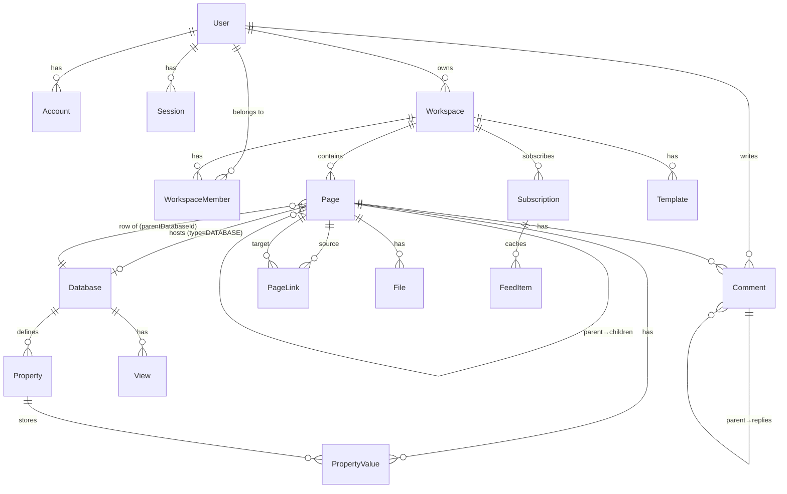

# obnofi — Database Schema

> PostgreSQL + Prisma ORM 기준. 현재 `lib/mock-db.ts` 인메모리 구현을 대체하는 실제 스키마.

---

## ER 다이어그램



---

## 테이블 명세

### 인증 (NextAuth.js 호환)

| 테이블 | 설명 |
|---|---|
| `Account` | OAuth 제공자 연결 (Google, GitHub) |
| `Session` | 세션 토큰 |
| `VerificationToken` | 이메일 인증 토큰 |

### 핵심 도메인

| 테이블 | 설명 |
|---|---|
| `User` | 사용자 프로필, 개인 설정 |
| `Workspace` | 워크스페이스. 한 유저가 여러 개 소유 가능 |
| `WorkspaceMember` | 유저↔워크스페이스 N:M, 역할 포함 |
| `Page` | 문서·캔버스·데이터베이스 페이지 + DB 행(row) 통합 |
| `Database` | 데이터베이스 메타데이터 (Page와 1:1) |
| `Property` | DB 필드 정의 (= 컬럼) |
| `PropertyValue` | 셀 값. (pageId, propertyId) 복합 유니크 |
| `View` | 테이블·보드·갤러리 등 뷰 설정 |

### 부가 기능

| 테이블 | 설명 |
|---|---|
| `File` | Supabase Storage 업로드 파일 레퍼런스 |
| `PageLink` | `[[링크]]` 파싱 결과. 그래프뷰 엣지 소스 |
| `Comment` | 페이지·블록 단위 댓글, 스레드 지원 |
| `Subscription` | Velog · OpenAI · Anthropic 블로그 구독 |
| `FeedItem` | 구독 피드 캐시 |
| `Template` | 저장된 템플릿 |

---

## Prisma Schema

```prisma
// prisma/schema.prisma

generator client {
  provider = "prisma-client-js"
}

datasource db {
  provider = "postgresql"
  url      = env("DATABASE_URL")
}

// ───────────────────────────────────────────────
// AUTH (NextAuth.js 어댑터 호환)
// ───────────────────────────────────────────────

model Account {
  id                String  @id @default(cuid())
  userId            String
  type              String
  provider          String
  providerAccountId String
  refresh_token     String? @db.Text
  access_token      String? @db.Text
  expires_at        Int?
  token_type        String?
  scope             String?
  id_token          String? @db.Text
  session_state     String?

  user User @relation(fields: [userId], references: [id], onDelete: Cascade)

  @@unique([provider, providerAccountId])
  @@index([userId])
}

model Session {
  id           String   @id @default(cuid())
  sessionToken String   @unique
  userId       String
  expires      DateTime

  user User @relation(fields: [userId], references: [id], onDelete: Cascade)

  @@index([userId])
}

model VerificationToken {
  identifier String
  token      String   @unique
  expires    DateTime

  @@unique([identifier, token])
}

// ───────────────────────────────────────────────
// USER
// ───────────────────────────────────────────────

model User {
  id            String    @id @default(cuid())
  name          String?
  email         String    @unique
  emailVerified DateTime?
  image         String?
  createdAt     DateTime  @default(now())
  updatedAt     DateTime  @updatedAt

  // 개인 설정 (폰트·하이라이트 팔레트·다크모드 등)
  // { fontFamily, fontSize, highlightColors: string[], darkMode }
  preferences Json @default("{}")

  accounts        Account[]
  sessions        Session[]
  ownedWorkspaces Workspace[]       @relation("WorkspaceOwner")
  memberships     WorkspaceMember[]
  comments        Comment[]
}

// ───────────────────────────────────────────────
// WORKSPACE
// ───────────────────────────────────────────────

model Workspace {
  id        String   @id @default(cuid())
  name      String
  slug      String   @unique
  icon      String?
  ownerId   String
  createdAt DateTime @default(now())
  updatedAt DateTime @updatedAt

  // 워크스페이스 설정 { defaultFont, theme, ... }
  settings Json @default("{}")

  owner         User              @relation("WorkspaceOwner", fields: [ownerId], references: [id])
  members       WorkspaceMember[]
  pages         Page[]
  subscriptions Subscription[]
  templates     Template[]
}

model WorkspaceMember {
  id          String   @id @default(cuid())
  workspaceId String
  userId      String
  role        Role     @default(MEMBER)
  joinedAt    DateTime @default(now())

  workspace Workspace @relation(fields: [workspaceId], references: [id], onDelete: Cascade)
  user      User      @relation(fields: [userId], references: [id], onDelete: Cascade)

  @@unique([workspaceId, userId])
  @@index([userId])
}

enum Role {
  OWNER
  EDITOR
  VIEWER
  MEMBER
}

// ───────────────────────────────────────────────
// PAGE
// 문서 · 캔버스 · 데이터베이스 페이지를 하나의 테이블로 관리.
// 데이터베이스 "행(row)"도 Page로 저장하며 parentDatabaseId로 구분.
// ───────────────────────────────────────────────

model Page {
  id           String   @id @default(cuid())
  title        String   @default("Untitled")
  content      Json?    // TipTap JSON document ({ type: "doc", content: [...] })
  type         PageType @default(DOCUMENT)
  icon         String?  // 이모지 또는 이미지 URL
  coverImage   String?  // 커버 이미지 URL (Supabase Storage)
  workspaceId  String
  parentId     String?  // 문서 트리 부모
  createdAt    DateTime @default(now())
  updatedAt    DateTime @updatedAt
  createdBy    String?  // User.id
  lastEditedBy String?  // User.id

  // 사이드바/DB 내 정렬 순서 — Fractional Indexing 사용 권장
  order Float @default(0)

  // 공개 공유
  isPublic      Boolean @default(false)
  shareId       String? @unique // nanoid(12)
  sharePassword String? // bcrypt 해시

  // DB 행인 경우 소속 Database.id
  parentDatabaseId String?

  workspace      Workspace       @relation(fields: [workspaceId], references: [id], onDelete: Cascade)
  parent         Page?           @relation("PageTree", fields: [parentId], references: [id])
  children       Page[]          @relation("PageTree")
  database       Database?       // type = DATABASE 일 때 1:1
  parentDatabase Database?       @relation("DatabaseRows", fields: [parentDatabaseId], references: [id])
  propertyValues PropertyValue[]
  comments       Comment[]
  outgoingLinks  PageLink[]      @relation("LinkSource")
  incomingLinks  PageLink[]      @relation("LinkTarget")
  files          File[]

  @@index([workspaceId])
  @@index([parentId])
  @@index([parentDatabaseId])
  @@index([shareId])
}

enum PageType {
  DOCUMENT
  CANVAS
  DATABASE
}

// ───────────────────────────────────────────────
// DATABASE
// Page(type=DATABASE)와 1:1. Property · View · Row(Page)를 거느림.
// ───────────────────────────────────────────────

model Database {
  id        String   @id @default(cuid())
  pageId    String   @unique
  createdAt DateTime @default(now())
  updatedAt DateTime @updatedAt

  page       Page       @relation(fields: [pageId], references: [id], onDelete: Cascade)
  properties Property[]
  rows       Page[]     @relation("DatabaseRows")
  views      View[]
}

// ───────────────────────────────────────────────
// PROPERTY (= Database Column)
// ───────────────────────────────────────────────

model Property {
  id         String       @id @default(cuid())
  databaseId String
  name       String
  type       PropertyType
  order      Float        @default(0)
  createdAt  DateTime     @default(now())
  updatedAt  DateTime     @updatedAt

  // SELECT · MULTI_SELECT · STATUS 전용
  // SelectOption[] = [{ id, label, color }]
  options Json?

  // RELATION 전용
  // { relatedDatabaseId: string, twoWay: boolean, twoWayPropertyName?: string }
  relationConfig Json?

  // ROLLUP 전용
  // { relationPropertyId: string, rollupPropertyId: string, function: "count"|"sum"|"avg"|"min"|"max" }
  rollupConfig Json?

  // FORMULA 전용
  // { expression: string }
  formulaConfig Json?

  database       Database        @relation(fields: [databaseId], references: [id], onDelete: Cascade)
  propertyValues PropertyValue[]

  @@index([databaseId])
}

enum PropertyType {
  TEXT
  NUMBER
  SELECT
  MULTI_SELECT
  STATUS
  DATE
  PERSON
  CHECKBOX
  URL
  EMAIL
  PHONE
  FILES
  RELATION
  ROLLUP
  FORMULA
  CREATED_TIME
  CREATED_BY
  LAST_EDITED_TIME
  LAST_EDITED_BY
}

// ───────────────────────────────────────────────
// PROPERTY VALUE (= Cell)
// value 구조는 PropertyType에 따른 Discriminated Union JSON
// ───────────────────────────────────────────────

model PropertyValue {
  id         String   @id @default(cuid())
  pageId     String
  propertyId String
  value      Json     // 타입별 JSON 구조 (하단 "Value JSON 명세" 참고)
  updatedAt  DateTime @updatedAt

  page     Page     @relation(fields: [pageId], references: [id], onDelete: Cascade)
  property Property @relation(fields: [propertyId], references: [id], onDelete: Cascade)

  @@unique([pageId, propertyId])
  @@index([propertyId])
}

// ───────────────────────────────────────────────
// VIEW
// ───────────────────────────────────────────────

model View {
  id         String   @id @default(cuid())
  databaseId String
  name       String
  type       ViewType @default(TABLE)
  order      Float    @default(0)
  createdAt  DateTime @default(now())
  updatedAt  DateTime @updatedAt

  // ViewConfig JSON (하단 "View Config 명세" 참고)
  config Json @default("{}")

  database Database @relation(fields: [databaseId], references: [id], onDelete: Cascade)

  @@index([databaseId])
}

enum ViewType {
  TABLE
  BOARD
  GALLERY
  LIST
  CALENDAR
  TIMELINE
}

// ───────────────────────────────────────────────
// FILE
// Supabase Storage 업로드 레퍼런스
// ───────────────────────────────────────────────

model File {
  id          String   @id @default(cuid())
  name        String
  url         String   // Supabase Storage public URL
  mimeType    String
  size        Int      // bytes
  pageId      String?
  workspaceId String
  uploadedBy  String   // User.id
  createdAt   DateTime @default(now())

  page Page? @relation(fields: [pageId], references: [id], onDelete: SetNull)

  @@index([pageId])
  @@index([workspaceId])
}

// ───────────────────────────────────────────────
// PAGE LINK
// [[링크]] 파싱 결과 → 그래프뷰 엣지
// ───────────────────────────────────────────────

model PageLink {
  id       String @id @default(cuid())
  sourceId String
  targetId String

  source Page @relation("LinkSource", fields: [sourceId], references: [id], onDelete: Cascade)
  target Page @relation("LinkTarget", fields: [targetId], references: [id], onDelete: Cascade)

  @@unique([sourceId, targetId])
  @@index([targetId])
}

// ───────────────────────────────────────────────
// COMMENT
// 페이지 또는 특정 블록(blockId)에 달리는 댓글.
// parentId 로 스레드 구성.
// ───────────────────────────────────────────────

model Comment {
  id        String   @id @default(cuid())
  pageId    String
  blockId   String?  // TipTap 블록 ID (선택)
  content   Json     // RichText[] (TipTap 노드 배열)
  parentId  String?  // 대댓글 부모
  resolved  Boolean  @default(false)
  authorId  String
  createdAt DateTime @default(now())
  updatedAt DateTime @updatedAt

  page    Page      @relation(fields: [pageId], references: [id], onDelete: Cascade)
  author  User      @relation(fields: [authorId], references: [id])
  parent  Comment?  @relation("CommentThread", fields: [parentId], references: [id])
  replies Comment[] @relation("CommentThread")

  @@index([pageId])
  @@index([authorId])
}

// ───────────────────────────────────────────────
// SUBSCRIPTION
// 블로그 구독 (Velog · OpenAI · Anthropic)
// ───────────────────────────────────────────────

model Subscription {
  id          String             @id @default(cuid())
  workspaceId String
  source      SubscriptionSource
  identifier  String             // velog: 유저명, openai/anthropic: 고정 slug
  displayName String?
  enabled     Boolean            @default(true)
  lastFetched DateTime?
  createdAt   DateTime           @default(now())

  workspace Workspace  @relation(fields: [workspaceId], references: [id], onDelete: Cascade)
  feedItems FeedItem[]

  @@unique([workspaceId, source, identifier])
  @@index([workspaceId])
}

enum SubscriptionSource {
  VELOG
  OPENAI_BLOG
  ANTHROPIC_BLOG
}

model FeedItem {
  id             String    @id @default(cuid())
  subscriptionId String
  title          String
  url            String
  summary        String?   @db.Text
  thumbnail      String?
  publishedAt    DateTime?
  fetchedAt      DateTime  @default(now())

  subscription Subscription @relation(fields: [subscriptionId], references: [id], onDelete: Cascade)

  @@unique([subscriptionId, url])
  @@index([subscriptionId])
}

// ───────────────────────────────────────────────
// TEMPLATE
// ───────────────────────────────────────────────

model Template {
  id          String   @id @default(cuid())
  workspaceId String
  name        String
  description String?
  type        PageType @default(DOCUMENT)
  content     Json     // TipTap JSON
  createdBy   String   // User.id
  createdAt   DateTime @default(now())
  updatedAt   DateTime @updatedAt

  workspace Workspace @relation(fields: [workspaceId], references: [id], onDelete: Cascade)

  @@index([workspaceId])
}
```

---

## PropertyValue JSON 명세

`PropertyValue.value` 필드의 타입별 구조.

```typescript
// TEXT · URL · EMAIL · PHONE
{ type: "text", text: string }

// NUMBER
{ type: "number", number: number | null }

// CHECKBOX
{ type: "checkbox", checked: boolean }

// SELECT
{ type: "select", optionId: string | null }

// MULTI_SELECT
{ type: "multi_select", optionIds: string[] }

// STATUS
{ type: "status", optionId: string | null }

// DATE
{ type: "date", start: string | null, end: string | null }  // ISO 8601

// PERSON
{ type: "person", userIds: string[] }

// FILES
{ type: "files", files: Array<{ name: string, url: string, mimeType: string }> }

// RELATION
{ type: "relation", pageIds: string[] }

// ROLLUP · FORMULA — 계산값 캐시 (읽기 전용)
{ type: "rollup",  result: number | string | null }
{ type: "formula", result: number | string | boolean | null }

// CREATED_TIME · LAST_EDITED_TIME — DB에서 직접 계산, 저장 불필요
// CREATED_BY · LAST_EDITED_BY — Page.createdBy / lastEditedBy 참조
```

---

## View Config JSON 명세

`View.config` 필드 구조.

```typescript
interface ViewConfig {
  // 공통
  visibleProperties: string[]          // Property.id 배열 (순서 = 컬럼 순서)
  propertyWidths:    Record<string, number>  // { [propertyId]: px }
  sorts:   Array<{ propertyId: string; direction: "asc" | "desc" }>
  filters: Array<{
    propertyId: string
    operator:   "equals" | "not_equals" | "contains" | "not_contains"
               | "is_empty" | "is_not_empty" | "gt" | "gte" | "lt" | "lte"
    value:      unknown
  }>

  // BOARD 전용
  groupBy?:      string    // Property.id (SELECT or STATUS)
  boardColumns?: string[]  // 컬럼 순서 (optionId 배열)

  // GALLERY 전용
  cardSize?:        "small" | "medium" | "large"
  showCoverImage?:  boolean
  coverImageProp?:  string  // Property.id (FILES 타입)

  // CALENDAR 전용
  calendarBy?: string  // Property.id (DATE 타입)

  // TIMELINE 전용
  timelineBy?: {
    startPropertyId: string
    endPropertyId?:  string
  }
}
```

---

## SelectOption JSON 명세

`Property.options` 배열 원소 구조.

```typescript
interface SelectOption {
  id:    string  // nanoid
  label: string
  color: "gray" | "brown" | "orange" | "yellow" | "green"
       | "blue" | "purple" | "pink" | "red"
}
```

---

## 인덱스 전략

| 인덱스 | 이유 |
|---|---|
| `Page(workspaceId)` | 사이드바 페이지 목록 조회 |
| `Page(parentId)` | 하위 페이지 조회 |
| `Page(parentDatabaseId)` | DB 행 목록 조회 |
| `Page(shareId)` | 공유 링크 접근 (UNIQUE) |
| `PropertyValue(pageId, propertyId)` | 셀 단위 upsert (UNIQUE) |
| `PropertyValue(propertyId)` | 컬럼 삭제 cascade |
| `PageLink(targetId)` | 백링크(backlinks) 조회 |
| `FeedItem(subscriptionId, url)` | 중복 피드 방지 (UNIQUE) |

---

## 카스케이드 삭제 규칙

```
Workspace 삭제
  └─ Page 삭제 (cascade)
       ├─ 하위 Page 삭제 (cascade)
       ├─ PropertyValue 삭제 (cascade)
       ├─ Comment 삭제 (cascade)
       ├─ PageLink 삭제 (cascade)
       └─ Database 삭제 (cascade)
            ├─ Property 삭제 (cascade)
            │    └─ PropertyValue 삭제 (cascade)
            ├─ View 삭제 (cascade)
            └─ Row(Page) — parentDatabaseId = null (SetNull)

File 삭제 시 pageId = null (SetNull, Supabase에서 실제 파일은 별도 처리)
```

---

## 설계 결정 노트

| 결정 | 이유 |
|---|---|
| Page 테이블에 DB 행(row) 통합 | 행도 제목·아이콘·커버·하위 페이지를 가질 수 있음. Notion 구조와 동일. |
| `content` JSONB | TipTap JSON 구조가 자주 바뀜. 블록 단위 정규화 대비 개발 속도 우선. |
| `options` JSONB (Property) | 셀렉트 옵션은 항상 Property와 함께 읽힘. JOIN 불필요. |
| `value` JSONB (PropertyValue) | 18가지 타입 각각 별도 테이블화 시 JOIN 비용 > JSONB 유연성. |
| `config` JSONB (View) | 뷰 설정 구조가 타입마다 상이. 스키마 변경 없이 확장 가능. |
| Fractional Indexing (`order Float`) | 재정렬 시 전체 order 업데이트 없이 중간값 삽입 가능. |
| `sharePassword` bcrypt 해시 | 원문 저장 금지. `/api/pages/[id]/verify` 엔드포인트에서 `bcrypt.compare`. |
| `PageLink` 별도 테이블 | 그래프뷰 엣지 쿼리 (`SELECT * WHERE targetId = ?`) 를 인덱스로 O(1) 처리. |
